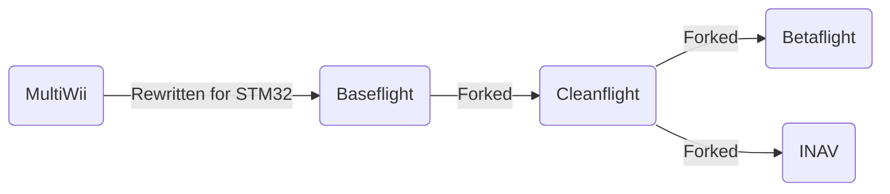

## What is INAV? 

INAV is a free and open source flight controller software for a multitude of air and land vehicles such as multirotors, fixed wings, VTOLs, rovers, and submarines.
The project has large releases annually and support releases as needed.
The software suite consists of the following components:

| Component           | Description                                                                                                       |
| ------------------- | ----------------------------------------------------------------------------------------------------------------- |
| INAV Firmware       | The software flashed on the flight controller board                                                               |
| INAV Configurator   | A graphical desktop tool that runs on a computer and allows for configuring and programming the flight controller |
| INAV Lua Widget     | An EdgeTX widget that augments the INAV experience                                                                |
| INAV Blackbox Tools | A tool to convert and use flight data recorded on the flight controller   

## How to Use The Docs

The docs have been structured in as logical manner as possible. 
It is advisible for all newcomers to INAV to visit the Getting Started section to learn how INAV works and setup an aircraft.

### Getting Started

This section is where all newcomers should visit to get acquianted with INAV.
It provides all the fundamental information for understanding key concepts and getting an aircraft configured for flight. 
The sections are organized sequentially and should be followed in order.

### Features

Explains in greater detail all of INAV's available features and how to use them

## History

### The family tree

In the beginning, there were no off-the-shelf flight controllers that were plug and play ready for your quad or plane.
The multirotor hobby began during the Ninentdo Wii era when the accessibility of inexpensive accelerometer and gyro sensors from the Wiimote Nunchucks inspired intrepid electronics hackers to repurpose them with Arduinos for multirotor flight controls - thus the MultiWii flight controller software was born.
The deveopment and popularity of MultiWii FC led to commercially available products like the KK/2.0 series.

Because MultiWii was based around the Arduino ATmega328, limitations were quickly reached with what could be done due to limited memory.
Allegedly, the former MultiWii flight controller rush led a small electronics company called Zhuque Intelligent New Shenzhen Co. Ltd to use their surplus STM32F103 to develop a multirotor flight controller called Freeflight, which ran their own firmware.
A user by the name of TimeCop saw the potential of Freeflight flight controllers and ported over MultiWii to STM32, which was called Baseflight.
TimeCop also saw the shortcomings of the Freeflight board and refined it by rearranging components and adding QOL features like a USB port and bootloader.
The FC developed from this was called Naze32 and ran Baseflight [1, DutchCommando].

Afterwards, drama in the community led to the Baseflight project being forked into Cleanflight.
Cleanflight had its share of internal drama as well.

Cleanflight's project vision wasn't shared by everyone, so users, namely BorisB, forked Cleanflight into Betaflight, whose vision was to develop more rapidly for 5in quads.

Last but definitely not least, another group of people, namely DigitalEntity, wanted navigation type features to be the focus and forked Cleanflight into INAV.

## Versions and Compatibility

Since INAV 4.0.0, the SemVer system has been used for deciding when the different parts of the version number changes.
This system makes it easy to see which versions of INAV are compatible.
The version number is made up of 3 sections, separated by dots.
These are major.minor.patch.

So with **INAV 7.1.2**:

- **7** is the major version number
- **1** is the minor version number
- **2** is the patch version number

Both the firmware and Configurator follow the same versioning scheme. The major version numbers match.

**Major** version numbers are increased when a change is made that breaks backwards compatibility.
This does not have to be a big change or new feature.
It can be something as simple as adding a new symbol on the OSD (due to the font update) or changing or removing a CLI parameter.
When the major version number is increased, the minor and patch version numbers are reset to 0.

**Minor** version numbers are increased when a a feature is added or updated that does not break backwards compatibility.
This can be complete new features, even new CLI parameters.
When the minor version number is increased, the patch version number is reset to 0.

**Patch** version numbers are increased when the release contains only bug fixes or new targets.

With INAV you must match the major version number of the [firmware](https://github.com/iNavFlight/inav) and [Configurator](https://github.com/iNavFlight/inav-configurator).
This has been the case for a long time, even pre-SemVer.
Before SemVer, the major and minor version numbers also had to be matched.
Now, it is recommended to use the latest version of Configurator that has the same major version number of your firmware. For example with firmware 7.0.0 it is recommended to use Configurator 7.1.2.
