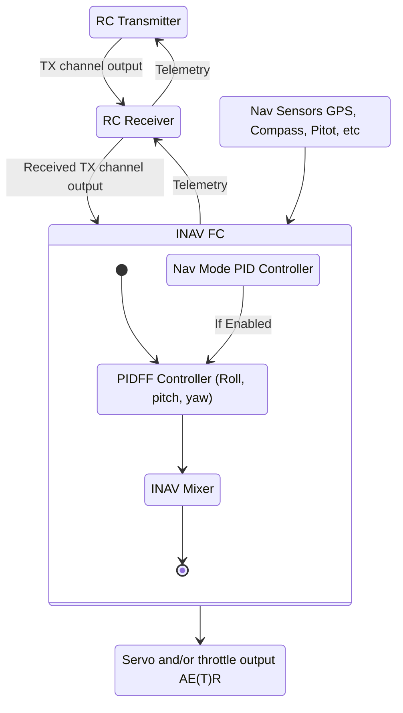

This section aims to provide a bird's eye view of INAV when applied to fixed wings.
The topics covered in this section are:

- INAV state diagram
- Fixed wing basics

## INAV State Diagram

Presented below is a state diagram showing a high level overview of the INAV control loop.
This should hopefully paint a picture of the control flow from the RC control link to expected outputs.

## Core Concepts

INAV has the ability to fly many differnt kinds of airplanes. 
There are conventional high wing/low wing, flying wings, electric ducted fan jets, sailplanes, multi motor configurations, differetial thrust setups, and more. 
Regardless of the kind of airplane, they all operate on several key principles needed for flight.

### Forces

There are four main forces that act on an aircraft in flight:

1. Thrust
1. Lift
1. Drag
1. Weight

**Thrust** is the forward force that keeps the airplane moving through the air. 
Motor(s) that drive a propeller are the primary devices that create thrust on RC airplanes.
In navigation modes, INAV has the ability to control thrust to maintain a reasonable speed for level flight. 
As thrust increases, drag does as well.
Thus for efficient flight, the cruise speed will typically be between 50% and 75% throttle depending on the configuration. 

**Lift** is the upward force produced by differential fluid movement of air over an airfoil such as a wing. 
In an airplane, lift is maintained by continuously moving through the air. 
This is controlled by the pilot using the control surfaces.
Lift is directly related to the concept of *angle of attack* (AOA), which is "the acute angle between the chord line of the airfoil and the direction of the relative wind" [Pilot's Handbook of Aeronautical Knowledge, FAA].

**Drag** is the force produced by the resistance of the airplane as it moves through the air. 
Lift is considered a type of induced drag as it disrupts the flow of air.
Parasitic drag is caused by friction of air hitting everything else on the aircraft, usually determined by the shape.
As speed increases, drag does as well. 

**Weight** is caused by the force of gravity pulling the mass of the aircraft down.
The weight of the aircraft is the primary cause of this.
The center of gravity is related to the weight as it can be considered the center of weight of the aircraft, resulting in where it will pivot in the air.
FPV platforms with large batteries may not always result in significantly longer flight itmes as the airframe will be fighting the additional weight. 

### Angle of Attack

### Degrees of Motion

An airplane, or any kind of vehicle, operates on three axes.
The axes are three lines that are each perpendicular to each other and represent the motion that an airplane can have by rotating about them.
These axes area associated with the following movements:

1. Pitch - up and down
1. Roll - tilt left and right
1. Yaw - side to side

On a RC aircraft, these form the three of the four main primary flight controls - the fourth being throttle for thrust.

### Control Surfaces

The physical devices on the airplane that allow it to change direction and move about its three axes are called the control surfaces. 
On a typical airplane, these and their associated control are:

1. Elevator - pitch
2. Ailerons - roll
3. Rudder - yaw

## RC Controls

To enable the control of a RC airplane in all its three axes, electric motors connected to a propeller or ducted fan blade are the primary sources of thrust.
Mechanical actuators called servos are used to move the three primary control surfaces.
The next section will describe how servos and motors are wired up in INAV.