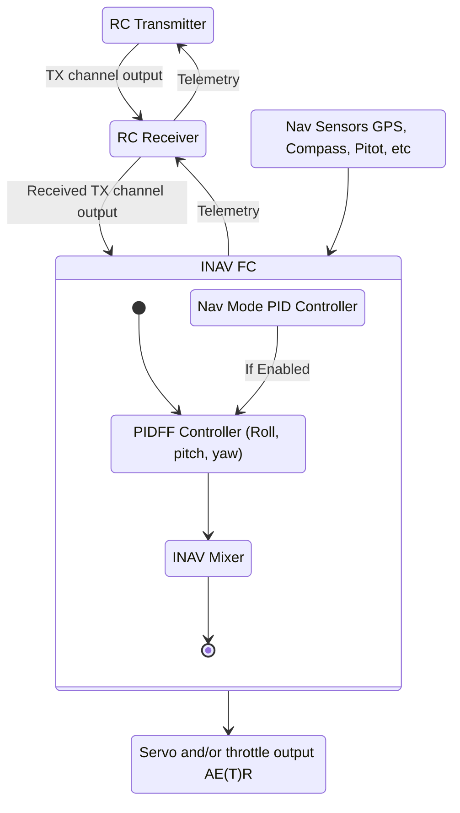

This section aims to provide a bird's eye view of INAV when applied to fixed wings.
The topics covered in this section are:

- INAV state diagram
- Fixed wing basics

## INAV State Diagram

Presented below is a state diagram showing a high level overview of the INAV control loop.
This should hopefully paint a picture of the control flow from the RC control link to expected outputs.

## Core Concepts
