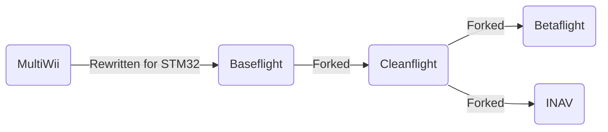

## History

#### The family tree

In the beginning, there were no off-the-shelf flight controllers that were plug and play ready for your quad or plane. 
The multirotor hobby began during the Ninentdo Wii era when the accessibility of inexpensive accelerometer and gyro sensors from the Wiimote Nunchucks inspired intrepid electronics hackers to repurpose them with Arduinos for multirotor flight controls - thus the MultiWii flight controller software was born. 
The deveopment and popularity of MultiWii FC led to commercially available products like the KK/2.0 series. 

Because MultiWii was based around the Arduino ATmega328, limitations were quickly reached with what could be done due to limited memory.
Allegedly, the former MultiWii flight controller rush led a small electronics company called Zhuque Intelligent New Shenzhen Co. Ltd to use their surplus STM32F103 to develop a multirotor flight controller called Freeflight, which ran their own firmware. 
A user by the name of TimeCop saw the potential of Freeflight flight controllers and ported over MultiWii to STM32, which was called Baseflight. 
TimeCop also saw the shortcomings of the Freeflight board and refined it by rearranging components and adding QOL features like a USB port and bootloader. 
The FC developed from this was called Naze32 and ran Baseflight [1, DutchCommando].

Afterwards, drama in the community led to the Baseflight project being forked into Cleanflight. 
Cleanflight had its share of internal drama as well.

Cleanflight's project vision wasn't shared by everyone, so users, namely BorisB, forked Cleanflight into Betaflight, whose vision was to develop more rapidly for 5in quads. 

Last but definitely not least, another group of people, namely DigitalEntity, wanted navigation type features to be the focus and forked Cleanflight into INAV.

## Hardware Summary

Currently, INAV runs on many commercially available STM32 based hardware just like Betaflight.
Recently, there have been some INAV tailored FC for fixed wings such as the SpeedyBee F405 Wing.

### MCU

The STM32 is what is known as the MCU or microcontroller unit.
There are many variations of the STM32 family of MCU that are supported as well as some by ArteryTek. 
The currently supported MCU are listed in the table below:

| Processor | Speed  | Flash |
|:---------:|:------:|:-----:|
| STM-F405  | 168Mhz |  1Mb  |
| STM-F722  | 216Mhz | 512k  |
| STM-F745  | 216Mhz |  1Mb  |
| STM-F765  | 216Mhz |  2Mb  |
| STM-H743  | 480Mhz |  2Mb  |
| AT-F435   | 288Mhz |  1Mb  |

### Voltage Regulator

### OSD

### IMU (Inertial Measurement Unit)

The IMU is what tells the quad or plane how it's behaving in space. 
It's typically comprised of a gyroscope and accelerometer.

### Barometer

### Magnetometer

### GNSS

### Optical Flow/Lidar

### Pitot Sensor

## References

1. https://www.youtube.com/watch?v=4Pf2TY1Tzg4
1. https://quadmeup.com/a-brief-history-of-a-flight-controller-from-multiwii-to-betaflight-and-beyond/