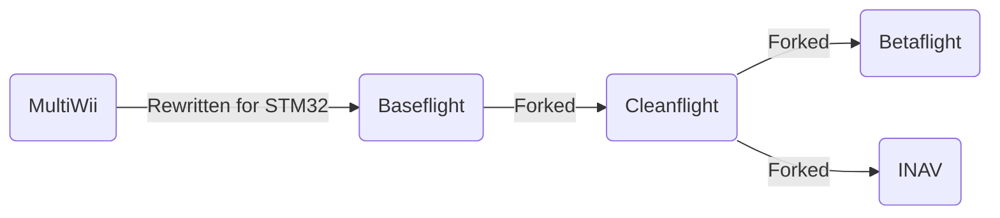

## History

#### The family tree

In the beginning, there were no off-the-shelf flight controllers that were plug and play ready for your quad or plane. 
The multirotor hobby began during the Ninentdo Wii era when the accessibility of inexpensive accelerometer and gyro sensors from the Wiimote Nunchucks inspired intrepid electronics hackers to repurpose them with Arduinos for multirotor flight controls - thus the MultiWii flight controller software was born. 
The deveopment and popularity of MultiWii FC led to commercially available products like the KK/2.0 series. 

Because MultiWii was based around the Arduino ATmega328, limitations were quickly reached with what could be done due to limited memory.
Allegedly, the former MultiWii flight controller rush led a small electronics company called Zhuque Intelligent New Shenzhen Co. Ltd to use their surplus STM32F103 to develop a multirotor flight controller called Freeflight, which ran their own firmware. 
A user by the name of TimeCop saw the potential of Freeflight flight controllers and ported over MultiWii to STM32, which was called Baseflight. 
TimeCop also saw the shortcomings of the Freeflight board and refined it by rearranging components and adding QOL features like a USB port and bootloader. 
The FC developed from this was called Naze32 and ran Baseflight [1, DutchCommando].

Afterwards, drama in the community led to the Baseflight project being forked into Cleanflight. 
Cleanflight had its share of internal drama as well.

Cleanflight's project vision wasn't shared by everyone, so users, namely BorisB, forked Cleanflight into Betaflight, whose vision was to develop more rapidly for 5in quads. 

Last but definitely not least, another group of people, namely DigitalEntity, wanted navigation type features to be the focus and forked Cleanflight into INAV.

## Hardware Summary

Currently, INAV runs on many commercially available STM32 based hardware just like Betaflight.
Recently, there have been some INAV tailored FC for fixed wings such as the SpeedyBee F405 Wing.

### MCU
:::note
INAV no longer accepts targets based on STM32 F411 MCU.

INAV 7 was the last INAV official release available for F411 based flight controllers. INAV 8 is not officially available for F411 boards and the team has not tested either. Issues that can't be reproduced on other MCUs may not be fixed and the targets for F411 targets may eventually be completelly removed from future releases.
:::

The MCU, or microcontroller unit can be thought of as the central processing unit of the flight controller or any embedded system.
The MCU is a single chip integrated circuit (IC) that consists of the processor unit, static RAM, flash memory like EEPROM, and input/output peripherals such as timers, coutners, ADC and DAC signal converters, and communication protocol such as UART, SPI, and I2C [3].

The STM32 is a family of the most popular MCUs used in flight controllers.
There are many variations of the STM32 family of MCU that are supported as well as some by ArteryTek. 
The currently supported MCU are listed in the table below:

| Processor | Speed  | Flash |
|:---------:|:------:|:-----:|
| STM-F405  | 168Mhz |  1Mb  |
| STM-F722  | 216Mhz | 512k  |
| STM-F745  | 216Mhz |  1Mb  |
| STM-F765  | 216Mhz |  2Mb  |
| STM-H743  | 480Mhz |  2Mb  |
| AT-F435   | 288Mhz |  1Mb  |

### Voltage Regulator
To power the flight controller, a crucial component that performs this function is the voltage regulator.
In the context of RC flight controllers, the voltage regulator takes an input DC voltage, usually from the battery, and converts it into usable voltages for the MCU and peripherals like the VTX pads and UART. This tends to be range from +3.3V to +12V.

### OSD
For pilots who flew, and still fly analog video, the on screen display (OSD) is a crucial feature that displays important flight parameters and can be individually customized. 
To enable this, a distinct chip, such as the AT7456E, which is found in many FCs, takes the video stream and overlays sprites before sending the video stream to the VTX to be broadcasted.

Pilots who opt to fly with digital systems do not utilize the OSD chip onboard the FC. 
Systems like Walksnail, DJI, and HDZero perform OSD functions on the VTX unit itself. 
However, the OSD in all systems are still configured using INAV Configurator.

### IMU (Inertial Measurement Unit)
The IMU is what tells the quad or plane how it's behaving in space. 
It's typically comprised of a gyroscope and accelerometer.
They can also contain magnetometers.
Each principle axis (x, y, z) for (roll, pitch, yaw) each need an accelometer and gyroscope to detect all 6 axes of movement [4]. 

#### Accelerometer
The accelerometer is a component that detects linear acceleration.
Most of the units found in hobbyist FC are micro-electromechanical (MEMS) type accelerometers that have a specifically calibrated spring or mass that induces an electrical current when acceleration is detected.
For stablized flight modes like angle and horizon, the accelerometer is required as it board's orientation can be determined.

#### Gyroscope
To detect angular rotation about an axis, or angular acceleration, the gyro is used. 
Gyros in this context are typically Coriolis MEMS gyros that use a resonating piece of mass attached to a reference frame by springs.
When rotation occurs, the mass vibrates about its axis, which induces electrical capacitance that's then used to determine the sensed rotation. 
A gyro is crucial for acro mode and failures of it will cause a multirotor to crash. 

### Barometer
The barometer is another MEMS compoment that senses the relative air pressure, which is used to determine altitude.
Barometers have a hole in the SMD case for the air pressure to be detected. 

### Magnetometer
The magnetometer is a component that measures magnetic fields to determine orientation - a compass.

### GNSS
:::note
INAV 8.0 will mark those GPS as deprecated and INAV 9.0.0 will require UBLOX units with Protocol version 15.00 or newer. This means that you need a GPS unit based on UBLOX M8 or newer.

If you want to check the protocol version of your unit, it is displayed in INAV's 7.0.0+ status cli command. INAV 8.0.0 will warn you if your GPS is too old. GPS: HW Version: Unknown Proto: 0.00 Baud: 115200 (UBLOX Proto >= 15.0 required)

M8, M9 and M10 GPS are the most common units in use today, are readly available and have similar capabilities. Mantaining and testing GPS changes across this many UBLOX versions is a challenge and takes a lot of time. Removing the support for older devices will simplify code.
:::
The most important component that easily enables many of INAV's navigation features is a global navigation satellite system receiver, or GNSS/GPS receiver.
Use of a GNSS receiver produces spatial parameters of the aircraft such as speed, altitude, and location. 
These parameters can be displayed in the OSD for navigation enhanced operation. 

### Optical Flow/Lidar
These sensors use a small camera or laser producing device to measure distance from the ground. 
Optical flow sensors typically have a lesser measuring range than lidar, but both function to help in automated navigation modes such as RTL.
INAV supports both optical flow and lidar sensors such as the MicoAir MTF-01 via a UART using a MSP connection.

### Airspeed Sensor
Also known as a pitot tube, this sensor measures fluid flow in aircraft to determine its airspeed. 
Unlike the GPS speed, airspeed tells us the amount of air flowing over its wings, which is often less than or greater than the aircraft's ground speed. 

## References

1. https://www.youtube.com/watch?v=4Pf2TY1Tzg4
1. https://quadmeup.com/a-brief-history-of-a-flight-controller-from-multiwii-to-betaflight-and-beyond/
1. https://www.ibm.com/think/topics/microcontroller
1. https://www.advancednavigation.com/tech-articles/inertial-measurement-unit-imu-an-introduction/