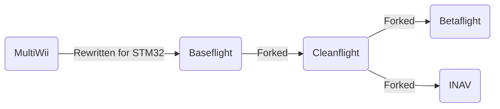

# Introduction to INAV

INAV is a flight controller software for a multitude of air and land vehicles such as multirotors, fixed wings, VTOLs, rovers, and submarines.
The software suite consists of the following components:

| Component | Description |
| --------- | ----------- |
| INAV Firmware | The software flashed on the flight controller |
| INAV Configurator | A graphical desktop tool that allows for configuring and programming the vehicle
| INAV Lua Widget | An EdgeTX widget that augments the INAV experience 
| INAV Blackbox Tools | A tool to convert and use flight data recorded on the flight controller

## Organization of the Docs

The docs are organized into serveral main sections:

| Section | Description |
| --- | --- |
| Getting Started | Provides all the fundamental information for quickly getting setup and started with INAV. 
| Features | Explains in greater detail all of INAV's available features and how to use them

## History
### The family tree

In the beginning, there were no off-the-shelf flight controllers that were plug and play ready for your quad or plane. 
The multirotor hobby began during the Ninentdo Wii era when the accessibility of inexpensive accelerometer and gyro sensors from the Wiimote Nunchucks inspired intrepid electronics hackers to repurpose them with Arduinos for multirotor flight controls - thus the MultiWii flight controller software was born. 
The deveopment and popularity of MultiWii FC led to commercially available products like the KK/2.0 series. 

Because MultiWii was based around the Arduino ATmega328, limitations were quickly reached with what could be done due to limited memory.
Allegedly, the former MultiWii flight controller rush led a small electronics company called Zhuque Intelligent New Shenzhen Co. Ltd to use their surplus STM32F103 to develop a multirotor flight controller called Freeflight, which ran their own firmware. 
A user by the name of TimeCop saw the potential of Freeflight flight controllers and ported over MultiWii to STM32, which was called Baseflight. 
TimeCop also saw the shortcomings of the Freeflight board and refined it by rearranging components and adding QOL features like a USB port and bootloader. 
The FC developed from this was called Naze32 and ran Baseflight [1, DutchCommando].

Afterwards, drama in the community led to the Baseflight project being forked into Cleanflight. 
Cleanflight had its share of internal drama as well.

Cleanflight's project vision wasn't shared by everyone, so users, namely BorisB, forked Cleanflight into Betaflight, whose vision was to develop more rapidly for 5in quads. 

Last but definitely not least, another group of people, namely DigitalEntity, wanted navigation type features to be the focus and forked Cleanflight into INAV.

